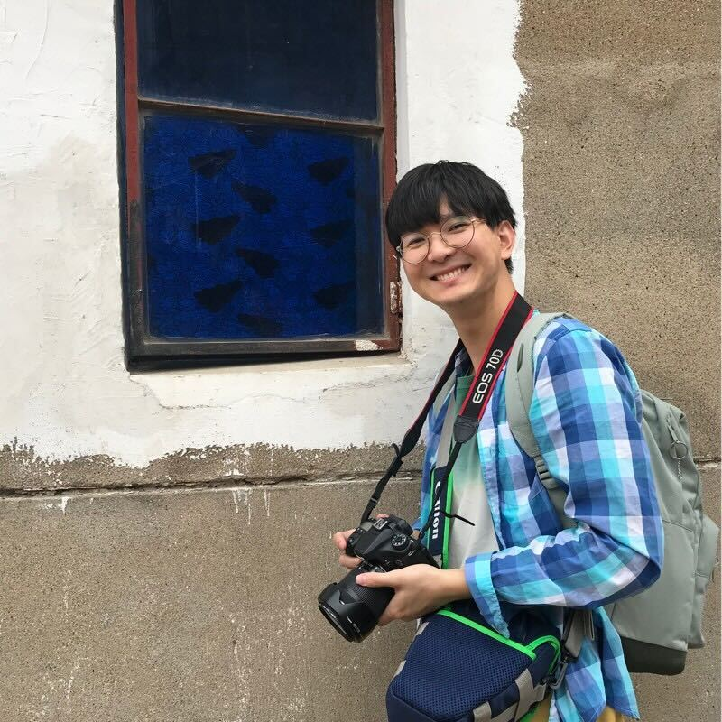
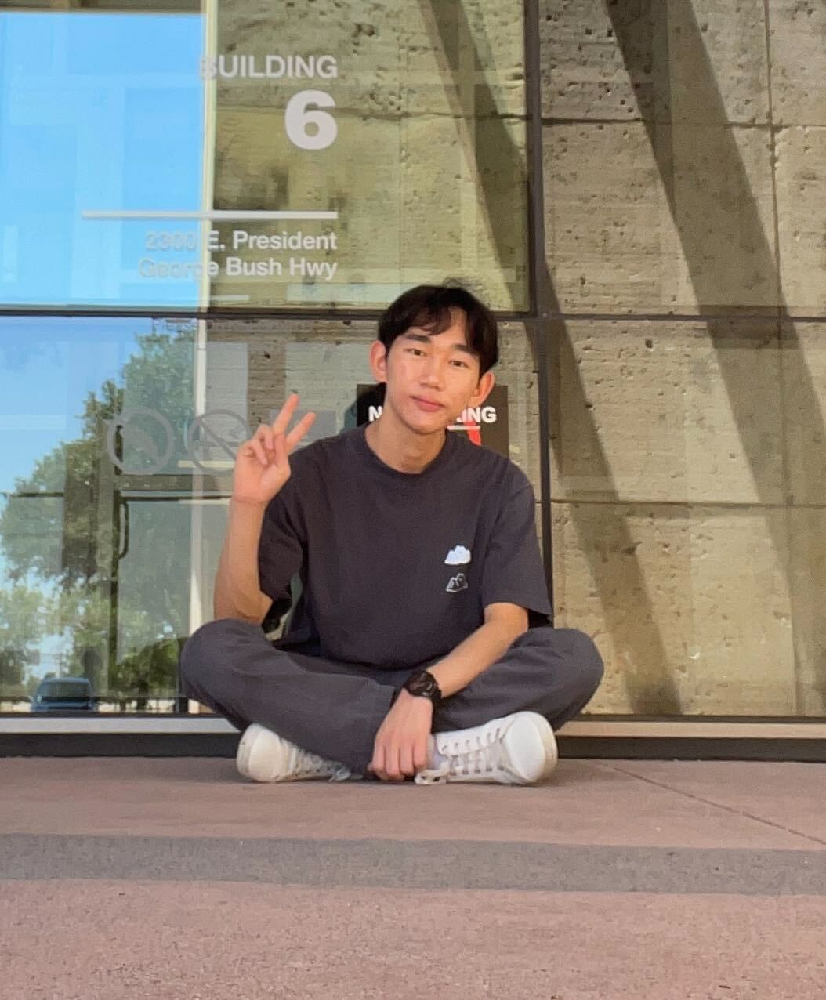

Lab Mission
======

The Distributed System Security Lab (DSSL) at San Diego State University aims to bring security to various distributed systems deployed on a large scale, including public blockchain networks, social networks, cloud storage, and distributed storage systems.

Current Members
======
<table>
<tr>
<td>&nbsp;&nbsp;&nbsp;&nbsp;&nbsp;&nbsp;</td>
<td>&nbsp;&nbsp;&nbsp;&nbsp;&nbsp;&nbsp;</td>
<td>&nbsp;&nbsp;&nbsp;&nbsp;&nbsp;&nbsp;</td>
<td>&nbsp;&nbsp;&nbsp;&nbsp;&nbsp;&nbsp;</td>
</tr>
  <tr>
<td align="center"><a href="https://www.linkedin.com/in/sxguan">Shixuan Guan</a>&nbsp;&nbsp;&nbsp;&nbsp;&nbsp;&nbsp;</td>
<td align="center"><a href="https://www.linkedin.com/in/nisheeagrawal">Nishee Agrawal</a>&nbsp;&nbsp;&nbsp;&nbsp;&nbsp;&nbsp;</td>
<td align="center"><a href="https://www.linkedin.com/in/darren-the-lee">Darren Lee</a>&nbsp;&nbsp;&nbsp;&nbsp;&nbsp;&nbsp;</td>
<td align="center"><a href="https://likai1993.github.io/lab/">Danyal Zina</a>&nbsp;&nbsp;&nbsp;&nbsp;&nbsp;&nbsp;</td>
    </tr>
</table>

<!--
<h2>Master Students</h2>

<table class="imgtable"><tbody><tr>

<td>&nbsp;&nbsp;&nbsp;&nbsp;&nbsp;&nbsp;</td>

<td>&nbsp;&nbsp;&nbsp;&nbsp;&nbsp;&nbsp;</a></td>

</tr><tr>

<td align="center"><a href="https://www.linkedin.com/in/sxguan">Shixuan Guan</a>&nbsp;&nbsp;&nbsp;&nbsp;&nbsp;&nbsp;</td>

<td align="center"><a href="https://www.linkedin.com/in/nisheeagrawal">Nishee Agrawal</a>&nbsp;&nbsp;&nbsp;&nbsp;&nbsp;&nbsp;</td>

</tr></tbody></table>

<h2>Undergraduate Students</h2>

<table class="imgtable"><tbody><tr>

<td>&nbsp;&nbsp;&nbsp;&nbsp;&nbsp;&nbsp;</td>

<td>&nbsp;&nbsp;&nbsp;&nbsp;&nbsp;&nbsp;</a></td>

</tr><tr>

<td align="center"><a href="https://www.linkedin.com/in/darren-the-lee">Darren Lee</a>&nbsp;&nbsp;&nbsp;&nbsp;&nbsp;&nbsp;</td>

<td align="center"><a href="">Danyal Zina</a>&nbsp;&nbsp;&nbsp;&nbsp;&nbsp;&nbsp;</td>

</tr></tbody></table>

-->

<!--  -->
<!--
**Shixuan Guan**: {:height="200px" width="200px"}
**Darren Lee**: {:height="200px" width="200px"}
**Danyal Zina**: {:height="100px" width="200px"}
-->

<!-- Darren is an undergraduate student in the CS department. His research interests lie in blockchain network DoS security. -->

<!--
<h3>Shixuan Guan</h3>
<figure class="figure">
  
  <figcaption class="figcaption">Shixuan Guan is a master's student in the CS department. His research interests include cryptocurrency scam detection and cross-chain security. </figcaption>
</figure>
<figure>
  
  <figcaption>Shixuan is a master's student in the CS department. His research interests include cryptocurrency scam detection and cross-chain security.</figcaption>
</figure>
<h3>Danyal Zina</h3>
<figure class="figure">
  
  <figcaption class="figcaption">Danyal is an undergraduate student in the CS department. His research interests lie in cryptocurrency scam detection. </figcaption>
</figure>
-->
